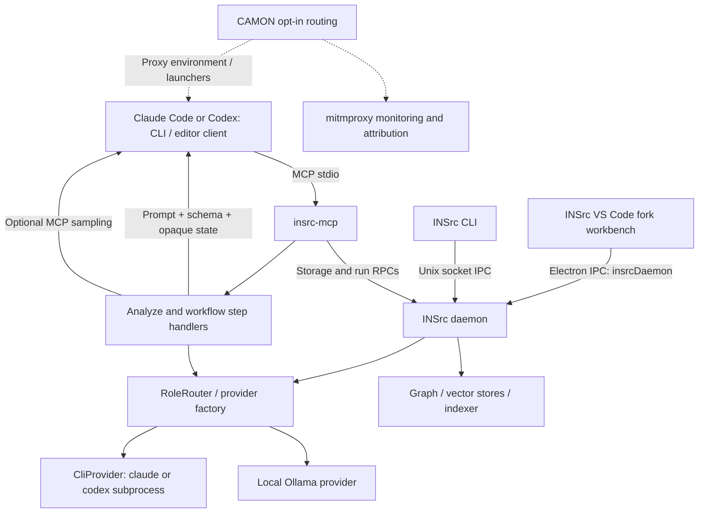

# INSrc agent integration review

Inspected 17 September 2026. Backend: `/Users/subhagho/work/projects/insors/insrc`, HEAD `db42b77d01157bad6623d4c47bfe7cb54ebc96fc`, package `@insrc/backend` 0.2.1. Relevant adjacent IDE source was inspected in `/Users/subhagho/work/projects/insors/insrc-ide`.

**Recommendation:** retain one INSrc MCP server and workflow protocol; introduce a capability-based registry with separate client-configuration, execution, editor, and monitoring adapters. Start with MCP plus instructions for all six agents. Add internal reasoning and editing only where an independently tested execution adapter exists.

This is a source inspection and documentation review, not a certification of installed agent versions or machine-wide configuration. No repository files, user settings, installations, or running agent configurations were changed. No builds or editing sessions were launched. The existing INSrc read-only analyze-step tool was exercised and its indexed symbols corroborated against source. The checkout already contained untracked work and additional JetBrains files appeared during inspection, so this is a snapshot of a concurrently active working tree. Those files were left alone.

## 1. Current-state architecture



The MCP process is not simply a transparent socket relay: it initializes built-in tools, data drivers and workflow runners, and hosts some analyze orchestration. Storage ownership remains daemon-side. The IDE bridge is separate from an agent's own VS Code extension.

### A. Agents consume INSrc through MCP

| Concern | Implemented source | Behavior |
|---|---|---|
| Executable | [package.json](/Users/subhagho/work/projects/insors/insrc/package.json:10), [insrc-mcp.ts](/Users/subhagho/work/projects/insors/insrc/src/bin/insrc-mcp.ts:1) | `insrc-mcp` resolves to `out/bin/insrc-mcp.js`; Node >=20. MCP logging goes to stderr. |
| Server and tool registration | [server.ts](/Users/subhagho/work/projects/insors/insrc/src/mcp/server.ts:119) | Registers ten public tools; shipped transport is stdio. Initializes internal tools/drivers/runners before serving. |
| Automatic client setup | [mcp-register.ts](/Users/subhagho/work/projects/insors/insrc/src/daemon/mcp-register.ts:96) | Explicit table for Claude and Codex; checks `mcp list`, then registers `node <absolute installed MCP JS>`. |
| Setup entry | [daemon/index.ts](/Users/subhagho/work/projects/insors/insrc/src/daemon/index.ts:479), [repo.ts](/Users/subhagho/work/projects/insors/insrc/src/cli/services/repo.ts:46) | `repo.add` can inject steering and register the selected clients. Failures are reported per operation; repo registration survives. |
| Repo binding | [resolve-repo.ts](/Users/subhagho/work/projects/insors/insrc/src/mcp/resolve-repo.ts:45) | Explicit `repo` → registered repo containing MCP process CWD → `INSRC_REPO` → error. Daemon lookup errors propagate. |
| Client identity | [server.ts](/Users/subhagho/work/projects/insors/insrc/src/mcp/server.ts:1141) | Lowercase substring match on MCP `clientInfo.name`: `codex` or `claude`; all others are unknown. |
| Sampling | [sampling-bridge.ts](/Users/subhagho/work/projects/insors/insrc/src/mcp/sampling-bridge.ts:47), [mcp-sampling-provider.ts](/Users/subhagho/work/projects/insors/insrc/src/agent/providers/mcp-sampling-provider.ts) | For one-shot analyze, use client sampling if declared; otherwise provider routing. This does not prove every client supports sampling or that every workflow uses it. |

The public tools are `insrc_analyze`, `insrc_analyze_step`, `insrc_workflow_step`, `insrc_build_step`, `insrc_review_step`, `insrc_code_review_step`, `insrc_triage`, `insrc_workflow_run`, `insrc_workflow_approve`, and `insrc_docgen`. The current server declares resources capability but I found no resource or MCP prompt registration in that server file. Internal daemon tools and entity/artifact RPCs are not automatically additional public MCP tools.

The two existing registration commands, as assembled by source, are:

```sh
claude mcp add insrc --scope user -- node <install-root>/out/bin/insrc-mcp.js
codex mcp add insrc -- node <install-root>/out/bin/insrc-mcp.js
```

Their idempotency check recognizes the name `insrc` in human-readable listing output. It does **not** compare the existing command, entrypoint, environment or installation path, so a stale server can be reported unchanged.

### B. Instructions and workflow control

[steering-inject.ts](/Users/subhagho/work/projects/insors/insrc/src/daemon/steering-inject.ts:1) installs the canonical [steering-block.md](/Users/subhagho/work/projects/insors/insrc/src/prompts/steering-block.md:1) into selected `CLAUDE.md` and/or `AGENTS.md` files. It uses `<!-- insrc:steering:start -->` / `<!-- insrc:steering:end -->`, preserving surrounding text and declining malformed marker edits. `copy-assets.mjs` ships prompt assets into `out`; maintenance can refresh existing marked blocks. [steering-template.md](/Users/subhagho/work/projects/insors/insrc/src/mcp/steering-template.md) points to the canonical source.

The steering covers grounded exploration and INSrc workflow routing. Multi-turn tools return the next action, prompt, schema and opaque state; the outer agent supplies reasoning and calls the next phase. This is already the strongest portable abstraction: it needs tool use and schema-following, without requiring subprocess inference or MCP sampling.

`CLAUDE.md` also contains the backend engineering guide. It is not byte-for-byte equivalent to the shipped steering block: guidance about when to prefer one-shot analyze differs. Generate future agent instructions from one source rather than copying the whole engineering guide into six formats.

The backend's actual [.claude/settings.local.json](/Users/subhagho/work/projects/insors/insrc/.claude/settings.local.json:1) contains allowed INSrc MCP tool names and an old, specific scratch-script Bash permission. It contains no hook or MCP-server definition. No backend `.vscode/`, `.codex/config.toml`, root `AGENTS.md`, or project `.mcp.json` was found in this inspection.

### C. INSrc consumes agent runtimes

[CliProvider](/Users/subhagho/work/projects/insors/insrc/src/agent/providers/cli-provider.ts:61) implements `LLMProvider`, with only `kind: 'claude' | 'codex'`.

| Mode | Claude Code invocation | Codex invocation |
|---|---|---|
| Text completion | `claude --print --output-format json [--model …]` | `codex exec --json [--model …]` |
| Schema output | Add `--json-schema '<schema>'`; read `structured_output` | Add `--output-schema <temporary-file>`; parse agent-message JSON |
| Editing | Add `--permission-mode acceptEdits`; run in repo CWD | Add `--full-auto`; run in repo CWD |

Prompts are supplied through stdin; message roles are flattened into text sections. The actual default timeout is 600,000 ms despite older comments saying 120 seconds. Binary discovery uses `which` and a cache, with one ENOENT retry. Subprocesses inherit the parent environment. Normal completions do not explicitly set repo CWD; edit calls do. Output is collected rather than streamed incrementally, and timeout kills the immediate child.

`structuredOutput=true`, `supportsTools=false`, `toolCalling=false`, `streaming=false`, `vision=false`, and `webSearch=false` describe this adapter surface. They do not describe all capabilities of the underlying agent. Embeddings are delegated separately. A CLI agent can still use its own tools internally; lack of an editing flag is not a reliable tool-disable boundary.

[config/analyze.ts](/Users/subhagho/work/projects/insors/insrc/src/config/analyze.ts:88), [RoleRouter](/Users/subhagho/work/projects/insors/insrc/src/analyze/context/role-router.ts), and [shaper-provider.ts](/Users/subhagho/work/projects/insors/insrc/src/analyze/context/shaper-provider.ts) route model tiers and roles. Recognized runners are only `ollama`, `cli-claude`, and `cli-codex`. The installer offers Claude/Codex reasoning profiles. Explicit tiers can override the invoking MCP client's inferred provider.

[workflow-rpc.ts](/Users/subhagho/work/projects/insors/insrc/src/daemon/workflow-rpc.ts), [code-review-rpc.ts](/Users/subhagho/work/projects/insors/insrc/src/daemon/code-review-rpc.ts), and workflow attribution also encode these families. A particularly important branch is [build validation](/Users/subhagho/work/projects/insors/insrc/src/mcp/build-step/phases/validate.ts:46): a non-CLI build runner falls back to **Claude**. Adding a new runner without changing this path would silently select the wrong agent.

The engineering constraint is to keep cloud inference behind external local agent runtimes rather than reintroduce cloud REST providers into the backend. Installed SDK dependencies such as `@google/genai` or `@mistralai/mistralai` do not establish Gemini CLI or Vibe integration.

### D. VS Code: what exists and what does not

There are two separate concepts:

1. **Claude/Codex's own extensions consuming INSrc MCP.** Codex's CLI and IDE use its MCP configuration, normally `~/.codex/config.toml`; trusted project configuration can also live under `.codex/config.toml`. Claude uses its native MCP scopes, with user/local entries in `~/.claude.json` and project entries in `.mcp.json`. Therefore the README/entrypoint example placing Claude MCP definitions in `~/.claude/settings.json` should be corrected. [Codex MCP documentation](https://developers.openai.com/codex/mcp), [Claude MCP scopes](https://code.claude.com/docs/en/mcp).
2. **INSrc's own VS Code fork.** [daemonServiceImpl.ts](/Users/subhagho/work/projects/insors/insrc-ide/src/vs/workbench/contrib/insrc/electron-sandbox/daemonServiceImpl.ts:310) connects through the main-process `insrcDaemon` channel. The workbench also contains LSP/tool-settings bridges and INSrc UI. It is not an MCP installation into arbitrary VS Code instances.

The fork registers `insrc.handoff.preferredAgent = auto | claude-code | codex` in [insrcConfiguration.ts](/Users/subhagho/work/projects/insors/insrc-ide/src/vs/workbench/contrib/insrc/common/insrcConfiguration.ts:347). I found no consumer of that setting in the searched workbench source. The backend explicitly maps `handoff.run`, `gate.request-permission`, and related gate/handoff RPCs to “backend offline.” The setting and stream comments cannot be treated as working editor handoff integration.

The inspected fork `.vscode/settings.json`, `extensions.json`, `launch.json`, and `tasks.json` contain no Claude/Codex/INSrc-MCP setup matches. No first-party Claude/Codex extension installation or command bridge was found in the searched integration source. Compatibility with their marketplace extensions in the fork remains a separate test.

### E. Hooks, wrappers and monitoring

The [permission-hook integration test](/Users/subhagho/work/projects/insors/insrc/src/bin/__tests__/permission-hook-integration.test.ts:29) references missing `src/bin/permission-hook.ts`; the current package has no hook executable. Its daemon target is explicitly offline at [daemon/index.ts](/Users/subhagho/work/projects/insors/insrc/src/daemon/index.ts:1619). Treat it as historical test intent, not active permission enforcement.

[scripts/insrc](/Users/subhagho/work/projects/insors/insrc/scripts/insrc) preserves launch CWD as `INSRC_CWD` while choosing built JS or source execution. [daemon-ctl.sh](/Users/subhagho/work/projects/insors/insrc/scripts/daemon-ctl.sh) supports `INSRC_DAEMON_ROOT`, `INSRC_CTL_LOG_DIR`, and launches with `INSRC_MODE=daemon`. [insrc-daemon-install.sh](/Users/subhagho/work/projects/insors/insrc/scripts/insrc-daemon-install.sh:279) builds/install-configures the backend and reasoning tiers, and prints MCP setup guidance.

CAMON is implemented separately in [camon/src/camon/setup.py](/Users/subhagho/work/projects/insors/insrc/camon/src/camon/setup.py:17):

- Claude setup merges `HTTP_PROXY`, `HTTPS_PROXY`, `ALL_PROXY`, `NO_PROXY`, and `NODE_EXTRA_CA_CERTS` into `~/.claude/settings.json`.
- Other supported agent commands receive opt-in launchers under `~/.insrc/camon/bin/camon-<agent>`; Codex's name is `camon-codex-cli`. Launchers preserve arguments and set proxy variables, but do not currently add certificate-trust variables.
- Supported discovery entries include Claude, Codex, Cursor, Continue, Cline, Roo and Aider. Gemini, Qwen, Vibe, OpenCode and OpenHands are absent from this table.
- `attribution.py`, `addon_runtime.py` and `extract.py` infer agent/provider information. A provider domain is not a reliable agent identity for multi-provider harnesses.
- No source connects the generated Codex launcher automatically to `CliProvider` or the Codex VS Code extension. Monitoring therefore depends on how each process is launched.

Additional environment contract: `INSRC_REPO` is the MCP fallback repo; `INSRC_LOG_LEVEL` and `INSRC_MODE` control logging; `INSRC_BUILD_STEP_TRACE` enables build tracing; `INSRC_LIVE_TESTS` gates live tests. `INSRC_DAEMON_SOCKET`, `INSRC_SPEC_ID`, and `INSRC_SESSION_ID` in the orphaned hook test are **not** evidence of an active hook contract. The normal shared socket path is `~/.insrc/daemon.sock` from [paths.ts](/Users/subhagho/work/projects/insors/insrc/src/shared/paths.ts).

## 2. Per-agent integration mapping

These are proposed configurations, not files installed by this review. All six can start with the same stdio executable. Agent authentication remains agent-owned; do not copy API keys into generated repo files.

For examples below, `/opt/insrc/out/bin/insrc-mcp.js` represents the resolved installation entrypoint, not a new required directory. Resolve Node to an absolute executable in generated machine configuration. Prefer an explicit `repo` argument on each tool call; avoid a globally pinned `INSRC_REPO`. Repo-scoped configurations may set it as fallback, remembering CWD resolution currently takes precedence.

| Agent | MCP configuration target | Instruction target | Internal execution recommendation | Editor integration |
|---|---|---|---|---|
| Gemini CLI | `~/.gemini/settings.json` or project `.gemini/settings.json` | `GEMINI.md` | Headless JSON/events adapter; host-validate payload schemas | Integrated terminal + Gemini CLI Companion; ACP optional |
| Qwen Code | `~/.qwen/settings.json` or project `.qwen/settings.json` | `QWEN.md` / configured context file | Headless adapter with native `--json-schema`, version checked | Qwen VS Code extension or integrated terminal |
| Mistral Vibe | `~/.vibe/config.toml` or project `.vibe/config.toml` | `AGENTS.md`; Vibe-specific agents only if needed | Programmatic JSON adapter with explicit tool policy and schema validation | Vibe extension shares CLI configuration |
| OpenCode | `~/.config/opencode/opencode.json` or project `opencode.json` | `AGENTS.md` or configured instructions | Local server/SDK for sessions and schema output | Official terminal/editor integration; optional ACP |
| Cline | Current docs: `~/.cline/data/settings/cline_mcp_settings.json` | Current docs: `.cline/rules/insrc.md` | MCP client first; separate versioned CLI/SDK execution qualification | Native Cline editor integration; detect storage generation |
| OpenHands | Existing CLI: `~/.openhands/mcp.json`; SDK: `Agent(mcp_config=...)` | Pass canonical instruction text through selected runtime's context interface | External worker/service adapter; avoid coupling backend to model SDK | Runtime/ACP integration must be version-specific |

### Gemini CLI

Merge into `.gemini/settings.json` or user settings:

```json
{
  "mcpServers": {
    "insrc": {
      "command": "node",
      "args": ["/opt/insrc/out/bin/insrc-mcp.js"]
    }
  }
}
```

Use the existing marked-section renderer for `GEMINI.md`. An extension package can later bundle MCP registration, instructions and commands, but is not required for initial support. Gemini documents stdio/HTTP MCP plus allow/exclude filtering. [Gemini MCP](https://geminicli.com/docs/tools/mcp-server/).

`gemini -p "<prompt>" --output-format json` supplies an envelope with `response`, `stats`, and optional `error`; `stream-json` supplies lifecycle/tool/result events. This is not itself an application JSON Schema guarantee. The execution adapter should parse the envelope, validate the inner payload, and perform bounded repair or return a typed error. [Headless reference](https://geminicli.com/docs/cli/headless/).

For optional mediation, render a `hooks.BeforeTool` entry in settings pointing to a **new** INSrc hook translator; translate Gemini's stdin/stdout protocol rather than reusing Claude output blindly. Hooks have blocking semantics and stdout must remain JSON-only. [Gemini hooks](https://geminicli.com/docs/hooks/reference/). The Companion extension adds editor context/diff interactions to CLI sessions; it should not be conflated with every Gemini Code Assist surface. [IDE integration](https://geminicli.com/docs/ide-integration/).

### Qwen Code

Use the same JSON body as Gemini in `.qwen/settings.json` or `~/.qwen/settings.json`. Generate the marked steering body into `QWEN.md`, subject to detecting any customized instruction filename. MCP supports scope-specific registration and command/args/env definitions. [Qwen MCP](https://qwenlm.github.io/qwen-code-docs/en/users/features/mcp/).

For schema calls, the currently documented shape is:

```sh
qwen -p "<prompt>" --json-schema @/absolute/path/schema.json
```

Its native structured-output mode has a distinct terminal contract; parse that mode separately from ordinary headless JSON envelopes. Do not reuse Claude's `structured_output` envelope parser without evidence. `--json-schema` is incompatible with ACP and stream-JSON input in the current documentation. [Qwen structured output](https://qwenlm.github.io/qwen-code-docs/en/users/features/structured-output/).

Qwen documents `PreToolUse`, `PostToolUse`, session events and hook-specific permission decisions in settings. Build a Qwen translator for its tool names, payload and timeout units. [Qwen hooks](https://qwenlm.github.io/qwen-code-docs/en/users/features/hooks/). Its own VS Code extension is a supported surface, but the INSrc fork still needs a compatibility test. [Qwen VS Code](https://qwenlm.github.io/qwen-code-docs/en/users/integration-vscode/).

### Mistral Vibe

Merge into `.vibe/config.toml` or `~/.vibe/config.toml`:

```toml
[[mcp_servers]]
name = "insrc"
transport = "stdio"
command = "node"
args = ["/opt/insrc/out/bin/insrc-mcp.js"]
```

Vibe uses repeated TOML tables, with optional startup/tool timeouts and environment. Its MCP tool naming pattern is server plus tool name, so INSrc tools are exposed with the corresponding doubled `insrc` prefix. Permissions must be rendered from tool identifiers, not copied from Claude allow strings. [Vibe MCP](https://docs.mistral.ai/vibe/code/cli/mcp-servers).

Use the existing `AGENTS.md` marked block. Project config and instructions depend on Vibe folder trust. Programmatic mode defaults to auto-approve unless a different agent is selected, so an INSrc reasoning adapter must supply a deliberate restrictive profile and bounded turns. Use `vibe --prompt "<prompt>" --max-turns 5 --output json` as the protocol starting point, not as a proven safe launch profile. Native arbitrary schema enforcement was not established by the inspected CLI docs. [CLI execution](https://docs.mistral.ai/vibe/code/cli/work-with-cli), [trust and approvals](https://docs.mistral.ai/vibe/code/safety-approvals-permissions).

Optional `.vibe/hooks.toml` can define `[[hooks]]`, `type = "pre_tool"`, a tool matcher, command and `strict = true`. Normalize its `decision`, `reason`, and `hook_specific_output` response separately. [Vibe hooks](https://docs.mistral.ai/vibe/code/cli/hooks). The VS Code extension shares the CLI configuration format; confirm the selected executable/profile in its settings. [Extension settings](https://docs.mistral.ai/vibe/code/vs-code-extension/settings).

### OpenCode

Merge into project `opencode.json`:

```json
{
  "$schema": "https://opencode.ai/config.json",
  "mcp": {
    "insrc": {
      "type": "local",
      "command": ["node", "/opt/insrc/out/bin/insrc-mcp.js"],
      "enabled": true
    }
  }
}
```

OpenCode's `command` is an array and its environment field is `environment`; it does not use the Gemini/Qwen `mcpServers` shape. Reuse `AGENTS.md` steering. [OpenCode MCP](https://opencode.ai/docs/mcp-servers/).

Prefer the local OpenCode server/SDK for managed INSrc execution: `session.prompt` accepts `format: {type: "json_schema", schema: ...}` and returns `info.structured_output`. This keeps inference inside the external agent service. Treat the local API transport as a runtime boundary rather than inserting a direct model API provider into INSrc. [OpenCode SDK](https://opencode.ai/docs/sdk/).

An optional `.opencode/plugins/insrc.ts` can translate `tool.execute.before`, `tool.execute.after`, and session events. A blocking pre-tool hook may throw; permission notifications are not automatically permission enforcement. [OpenCode plugins](https://opencode.ai/docs/plugins/). The editor integration launches/focuses terminal sessions and supplies selection/file context; an INSrc-owned ACP client is a separate future UI choice. [OpenCode IDE](https://opencode.ai/docs/ide/).

### Cline

The current official configuration page describes shared `~/.cline/data/settings/cline_mcp_settings.json` across IDE/CLI/SDK and project `.cline/rules/` / `.cline/hooks/`. Older installed extensions may still use VS Code globalStorage and `.clinerules`. Detect version and active storage root; do not blindly write both generations. Honor `CLINE_DATA_DIR`. [Cline configuration](https://docs.cline.bot/getting-started/config).

Merge this into the active MCP settings file:

```json
{
  "mcpServers": {
    "insrc": {
      "command": "node",
      "args": ["/opt/insrc/out/bin/insrc-mcp.js"],
      "disabled": false,
      "autoApprove": []
    }
  }
}
```

Use `.cline/rules/insrc.md` for the current generation, or a versioned legacy rule target. Cline documents both the editor MCP panel and `cline mcp` configuration wizard. Empty `autoApprove` preserves interactive decisions until the adapter explicitly maps approved tool policy. [Cline MCP](https://docs.cline.bot/mcp/mcp-overview).

Keep initial support at MCP-client level. A Cline runtime adapter requires version-specific event, cancellation and permission tests; existence of a CLI is not proof of drop-in `CliProvider` equivalence. The current hooks page returned no substantive contract during this review. The first-party repository documents legacy executable `.clinerules/hooks/PreToolUse` hooks; use that only for a matched version, not as the asserted current universal interface. [Cline hook source documentation](https://github.com/cline/cline/blob/main/.clinerules/hooks/README.md).

### OpenHands

For an existing compatible CLI deployment, the documented command is:

```sh
openhands mcp add insrc --transport stdio node -- /opt/insrc/out/bin/insrc-mcp.js
```

It writes JSON MCP configuration under `~/.openhands/mcp.json`; older pre-1.0 TOML configuration is different. This is a compatibility target, not the recommended foundation for new execution work. [OpenHands CLI MCP](https://docs.openhands.dev/openhands/usage/cli/mcp-servers).

For a separately managed SDK worker, the same tool server can be attached as:

```python
mcp_config = {
    "mcpServers": {
        "insrc": {
            "command": "node",
            "args": ["/opt/insrc/out/bin/insrc-mcp.js"],
        }
    }
}
# Within an existing, authenticated OpenHands worker:
agent = Agent(llm=llm, tools=tools, mcp_config=mcp_config)
```

The SDK owns its model/auth configuration. INSrc should exchange jobs/results with that external worker rather than import its cloud inference into the backend. Inject the canonical steering through the worker's context mechanism after selecting its version. [OpenHands SDK MCP](https://docs.openhands.dev/sdk/guides/mcp).

The fetched documentation now places CLI under “Deprecated Projects”; its headless mode always approves actions. Do not promise it as a controlled reasoning-only subprocess. [OpenHands headless](https://docs.openhands.dev/openhands/usage/cli/headless). Repository hooks use `.openhands/hooks.json`, with events such as `pre_tool_use` and `stop`; normalize tool names such as `terminal`, and retain external isolation. [OpenHands hooks](https://docs.openhands.dev/openhands/usage/customization/hooks).

For containers/remote workers, `/opt/insrc/...`, the repo paths and daemon socket must exist in that execution environment. A Mac path cannot be copied into Linux config. Prefer a colocated INSrc daemon initially. An authenticated HTTP MCP gateway is future work; the present stdio binary does not provide one.

## 3. Common adapter design

### Keep domain logic independent of agent identity

Do not turn `CliProvider` into an eight-way switch. Introduce a registry whose entries independently offer:

```ts
type AgentId = string;
type RuntimeTransport = 'subprocess' | 'local-service' | 'external-worker';

interface AgentAdapter {
  id: AgentId;
  detect(host: HostContext): Promise<DetectedAgent>; // version, executable, surface
  capabilities: AgentCapabilities;
  client: McpClientAdapter;
  execution?: ExecutionAdapter;
  editor?: EditorAdapter;
  monitoring?: MonitoringAdapter;
}

interface McpClientAdapter {
  inspect(target: ConfigTarget): Promise<RegistrationState>;
  plan(target: ConfigTarget, server: McpServerSpec,
       instructions: InstructionBundle): Promise<ConfigChangePlan>;
  verify(target: ConfigTarget): Promise<ProbeResult>;
}

interface ExecutionAdapter {
  transport: RuntimeTransport;
  run(request: AgentRunRequest): AsyncIterable<AgentRunEvent>;
  cancel(runId: string): Promise<void>;
}

interface AgentCapabilities {
  schemaOutput: 'native' | 'validated-repair' | 'none';
  events: boolean;
  resume: boolean;
  editSession: boolean;
  permissionMediation: 'blocking' | 'observe-only' | 'none';
  mcpSampling: 'negotiated';
}
```

These are proposed interfaces. `AgentRunRequest` should carry run ID, agent ID, independently specified provider/model, repo/worktree, prompt/messages, schema, allowed tools, execution policy, timeout, maximum turns, environment references and optional resume ID. `AgentRunEvent` should distinguish progress, tool request/result, permission request, usage, completed, failed and cancelled. A completed result must represent the final outcome, not the first assistant message.

Keep `LLMProvider` as a compatibility facade over an execution adapter for `complete` / `completeStructured`. Keep editing a separate capability; embeddings should remain their own local facility. Define host-side schema validation for all adapters, including native schema modes. “Returns JSON” is not a sufficient capability definition.

### Proposed file layout

```text
src/integrations/
  types.ts
  registry.ts
  config-plan.ts
  instructions.ts
  policy.ts
  process-runner.ts
  event-normalizer.ts
  adapters/
    claude.ts
    codex.ts
    gemini.ts
    qwen.ts
    vibe.ts
    opencode.ts
    cline.ts
    openhands.ts
  __tests__/
    config-roundtrip.test.ts
    runtime-contract.test.ts
    policy-contract.test.ts
src/bin/insrc-agent-hook.ts          # new, only after policy implementation
```

Keep Python CAMON behind a serializable discovery/monitoring manifest, rather than making it import TypeScript or duplicate the entire registry. Preserve existing external IDs (`claude-code`, `codex-cli`) as aliases during migration.

### Model selection and client selection are independent

Replace `SteeringSelection {claude, agents}` with a list of client targets. Stop making “write AGENTS.md” mean “register Codex”: Vibe and OpenCode share that file. Coalesce instruction edits by physical target to avoid duplicate blocks.

A proposed configuration shape is:

```json
{
  "integrations": {
    "clients": ["claude", "codex", "gemini", "qwen", "vibe", "opencode", "cline", "openhands"],
    "defaultExecutionAgent": "qwen"
  },
  "models": {
    "tiers": {
      "core": {"runner": "agent", "agent": "qwen", "model": "<configured-model-id>"},
      "mid": {"runner": "agent", "agent": "qwen", "model": "<configured-model-id>"},
      "cheap": {"runner": "ollama", "model": "<configured-local-model>"}
    }
  }
}
```

This is a future schema, not accepted by current INSrc. Migrate legacy `cli-claude` / `cli-codex` values. A multi-provider agent must retain separate harness, model-provider and model fields. Unknown clients must not silently inherit Claude attribution or execution.

### Configuration, instructions and execution policy

- Use one `McpServerSpec` with executable, args, environment references, transport and repo-binding policy. Render JSON/JSONC/TOML shapes per client.
- Configuration planning should return before/after diffs, preserve unrelated content/comments, identify managed entries, support removal and detect stale paths. Apply writes atomically. Do not rely on substring checks of human-readable listings.
- Preserve the canonical INSrc workflow instruction body. Render marked files or dedicated rule files according to client capability. Tool names in permission settings should be generated separately from instruction prose.
- Standardize policy intents such as `reasoning`, `read-only-review`, and `workspace-edit`. Translate them to each runtime's tools, sandbox and permissions. A tool hook is an additional mediation mechanism, not a replacement for an execution boundary.
- Implement a new policy service before emitting hook configuration. The present offline `gate.request-permission` cannot back a working adapter.
- Keep controller-driven step tools available for every MCP client. Use sampling only after runtime capability negotiation; record whether work ran in the outer client, sampling, local model or external agent.
- Distinguish task cancellation from network retry. Retrying a partially completed edit can repeat side effects; use task-state checks or resume semantics rather than replaying the prompt unconditionally.

### Required steering templates

Steering is a required integration deliverable alongside MCP registration. Registration exposes tools; steering tells the agent when to use them and how to complete INSrc's workflows. The existing filename is `AGENTS.md` (plural), not `AGENT.md`.

Extend the existing canonical `src/prompts/steering-block.md` and marked-section renderer rather than maintain eight independent copies of the workflow rules. The destinations below follow the client mechanisms described in Section 2; detect configured overrides and supported versions before choosing a target.

| Agent | Controller steering destination | Rendering requirement |
|---|---|---|
| Codex | `AGENTS.md` | Preserve surrounding project instructions with the existing managed markers. |
| Claude Code | `CLAUDE.md` | Preserve the engineering guide and other user instructions. |
| Gemini CLI | `GEMINI.md` | Render the same workflow rules with Gemini-specific tool guidance. |
| Qwen Code | `QWEN.md`, or its configured context filename | Respect customized instruction discovery. |
| Mistral Vibe | `AGENTS.md` | Account for project trust before claiming instructions are active. |
| OpenCode | `AGENTS.md`, or a file explicitly listed in `instructions` | Prefer an explicit configured file when sharing modular instructions. |
| Cline | `.cline/rules/insrc.md`; supported legacy versions use `.clinerules/` | Select one configuration generation, avoiding duplicate rule loading. |
| OpenHands | Selected runtime's context/instruction mechanism | Load the canonical text explicitly in the worker; verify runtime-specific discovery rather than assume a universal filename. |

OpenCode documents both `AGENTS.md` and explicit instruction-file configuration; Qwen documents its memory/context mechanism. [OpenCode rules](https://opencode.ai/docs/rules/), [Qwen memory](https://qwenlm.github.io/qwen-code-docs/en/users/features/memory/).

The shared controller template must cover:

| Requirement | Required steering behavior |
|---|---|
| Repository grounding | Use INSrc analysis for repository exploration, choosing one-shot or step mode according to the canonical guidance. Fall back to direct inspection when results are missing, unsuitable, or unavailable, and disclose that limitation. |
| Workflow routing | Use triage for actionable engineering requests and follow the selected workflow. Do not force unrelated questions through an engineering workflow. |
| Step protocol | Follow returned `next`, `prompt`, and `schema`; preserve opaque `state` verbatim and submit the required phase input. |
| Review and approval | Distinguish design review from code review and both from approval. Respect user authorization and the workflow's explicit approval gates. |
| Workspace identity | Pass the intended repository explicitly and keep the same binding throughout a run. |
| Progress and recovery | Relay meaningful progress; report failed phases or unavailable tools; never claim completion without a completed result. |

Each agent-specific addition should be small: instruction discovery, tool-name mapping, supported interaction modes, and known limitations. Generate permission settings and hook definitions separately; prose steering cannot enforce permissions.

#### Three execution profiles

The outer controller and INSrc's internal subprocesses need different instruction profiles. Giving an internal reasoning call the full controller template can cause it to invoke INSrc recursively.

| Profile | Intended recipient | Template responsibilities |
|---|---|---|
| `controller` | User-facing CLI or editor agent | Ground the request, orchestrate triage/workflows, preserve state, communicate progress and honor review/approval gates. |
| `reasoning` | Bounded internal completion or schema call | Perform only the assigned inference using supplied evidence; return the requested schema; do not initiate another INSrc workflow or edit files. |
| `editing` | Explicitly authorized edit session | Work within the assigned repo/worktree and task scope; implement the supplied plan; report changes and checks; return control for independent verification and approval. |

These profiles are proposed behavior, not capabilities already implemented. Runtime adapters must also restrict tools, workspace and inherited configuration where supported. If a runtime cannot isolate its internal reasoning profile from project controller instructions, do not advertise that execution mode as qualified. Retain controller-driven MCP steps as the fallback.

A proposed template organization is:

```text
src/prompts/integrations/
  shared.md
  controller.md
  reasoning.md
  editing.md
  agents/
    claude.md
    codex.md
    gemini.md
    qwen.md
    vibe.md
    opencode.md
    cline.md
    openhands.md
```

Keep `steering-block.md` as a compatibility output or entrypoint during migration. Render shared rules plus exactly one profile and one agent-specific section. Include a template version/content hash in managed metadata; coalesce shared `AGENTS.md` targets so enabling Codex, Vibe and OpenCode does not insert three copies. Preserve existing marker safeguards and extend refresh/removal to all supported destinations.

Template qualification should verify instruction discovery after reload, preservation of user content, shared-file deduplication, correct tool names, schema/state handling, unavailable-tool recovery, approval behavior and absence of recursive workflow calls from internal reasoning sessions. Runtime permission tests must independently verify that a reasoning profile cannot write files.

### Editor abstraction

For ordinary VS Code, begin with each agent's existing extension or a terminal launcher. A future INSrc editor adapter can expose detect/open session/send context/reveal artifact capabilities, without pretending every extension exposes the same command API. For the INSrc fork, use one shared editor-facing registry and optional ACP client, while keeping MCP configuration generation separate. Remote extension hosts need their own install/config targets.

## 4. Gaps and limitations

| Priority | Finding | Impact / proposed response |
|---|---|---|
| P0 | MCP setup, runner unions, client inference, workflow RPC parameters and attribution encode Claude/Codex | New client can call step tools but use an unintended internal runner. Replace with explicit registry lookup and capability checks. |
| P0 | Build validation falls back to Claude for unsupported runner | Fail clearly or choose an explicitly configured editing runtime. |
| P0 | Hook implementation missing; gate/handoff RPCs offline | Do not market existing hook enforcement or complete IDE handoff. Implement/retire deliberately. |
| P0 | Completion subprocesses inherit environment/CWD/config; tools are not explicitly isolated | Recursive INSrc calls, wrong workspace and inherited permissions are possible. Establish deliberate execution profiles and an INSrc-call recursion guard. |
| P1 | MCP registration checks name only | Stale installation paths can persist; reconcile the full server specification. |
| P1 | Repo binding assumes meaningful MCP process CWD | Editor/service/container launchers can violate it. Test explicit repo propagation and multi-root workspaces. |
| P1 | Codex parser selects the first matching completed agent message | Multi-message event streams may produce the wrong result; normalize final-turn semantics. |
| P1 | Generic retries include edit sessions; immediate-child timeout only | Duplicate edits and orphaned children are possible. Add cancellation/process-tree lifecycle and replay classification. |
| P1 | Prompt roles flattened; schema results mostly trusted after CLI parsing | Add host-side validation, typed failures and documented loss of conversational structure. |
| P1 | README Claude config location and several old architecture comments drift from source | Generate examples from tested renderers; distinguish retained stubs from live features. |
| P1 | CAMON launchers are independent of runtime/editor launch; certificate treatment differs | A “launcher ready” status does not prove traffic capture or TLS trust. Reuse launch policy and verify each runtime. |
| P2 | No shipped HTTP MCP endpoint | Remote OpenHands needs colocation first or an explicitly designed authenticated gateway. |
| P2 | New-agent hooks and extension generations vary | Version-pin qualified capabilities; unsupported modes should be visible, not silently emulated. |

MCP sampling support, exact installed executable versions, extension-host configuration behavior, OAuth state, billing, and successful editing with the six new agents were not live-tested. Documentation establishes a route to integration; it does not establish INSrc compatibility. Mistral's MCP page and its repository changelog also differ on OAuth support, so no OAuth dependency is proposed for local stdio integration.

## 5. Prioritized implementation plan

| Stage | Concrete changes | Completion criteria |
|---|---|---|
| 0 — Make current behavior explicit | Correct Claude MCP examples; document offline handoff/hooks; locate all runner switches; remove implicit Claude fallback; define supported versions | Current Claude/Codex config and runtime fixtures pass; unsupported runner returns an actionable error. |
| 1 — Extract shared abstractions | Add registry, config plans, instruction targets and process/event interfaces; define shared steering plus controller/reasoning/editing profiles; migrate existing agents | Existing clients preserve registration/workflow behavior; repeated plan/apply yields no diff; stale paths detected; managed instructions preserve user content. |
| 2 — Universal MCP client support | Add six client configuration renderers and required controller templates, including versioned discovery and shared-file deduplication | Each qualified client loads its steering after reload, lists INSrc tools and completes an explicit-repo analyze-step loop; no wrong-repo resolution or duplicate steering. |
| 3 — First execution adapters | Qwen native schema adapter, Gemini validated-output adapter, Vibe explicit-policy adapter; wire bounded reasoning and scoped editing profiles through the `LLMProvider` facade | Schema success/failure, auth failure, timeout, cancellation and tool restrictions verified; internal reasoning cannot edit or recursively orchestrate INSrc. |
| 4 — Rich local service adapter | OpenCode session/SDK adapter, events, native schema mode and cancellation | Correct final output and usage; resumed sessions scoped to the right repo; service startup/shutdown ownership tested. |
| 5 — Editor completion | Populate agent selection from registry; connect supported terminal/extension/ACP paths; replace orphaned handoff UI behavior | CLI and VS Code paths independently tested, including reload, missing executable and remote workspace cases. |
| 6 — Mediation and monitoring | Implement normalized policy service and new hook binary; per-agent hook translators; shared CAMON metadata and launch policy | Denied operations demonstrably do not execute; unavailable policy service has declared behavior; no false “monitored” status. |
| 7 — Cline/OpenHands execution qualification | Pin Cline generation and OpenHands runtime; external worker protocol, path mapping and optional gateway design | Job isolation, repo mapping, artifact return, cancellation and credentials ownership validated. |

Stage 2 is independently useful and should not wait for runtime parity. Qwen is the closest next schema-execution fit; Gemini and Vibe have straightforward client setup but require more output/policy qualification. OpenCode merits a service adapter rather than another CLI-parser branch. Cline and OpenHands should initially be fully supported MCP clients with clearly limited execution claims.

The test strategy should cover behavior, not just generated strings: initialize/list/call; instruction discovery after reload; tool namespace policy; invalid schema results; a failed or interrupted run; final-message selection; preserving unrelated config; moving an installation; multiple repos; and proving read-only execution cannot write. Live mutation tests belong in disposable repositories and should use the agent's own authenticated configuration only after the implementation task is authorized.
